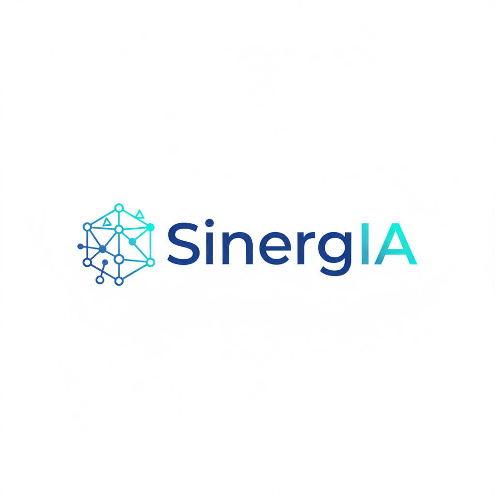

# 🚀 SinergIA - Plataforma Premium de Sistemas Operacionais de IA



## 📋 Sobre o Projeto

**SinergIA** é uma plataforma completa de sistemas operacionais de IA projetada para transformar negócios através da automação inteligente. A plataforma oferece soluções especializadas para diferentes nichos de mercado, com foco em resultados mensuráveis e ROI comprovado.

### 🎯 Principais Características

- **Design HIGH-TICKET Premium**: Interface sofisticada para mercado B2B de alto valor
- **3 Sistemas de IA Especializados**: Qualifica, Atende e Opera
- **8 Nichos de Mercado**: Soluções customizadas para diferentes setores
- **3 Ferramentas Interativas**: Calculadora de ROI, Simulador de Fluxos, Arquiteto de Soluções
- **Integrações Empresariais**: APIs conectáveis com mais de 5000 aplicações
- **Métricas em Tempo Real**: Dashboard com dados atualizados automaticamente

## 🛠️ Tecnologias Utilizadas

### Frontend
- **React 19** - Framework principal
- **Vite 6.3.5** - Build tool e dev server
- **Tailwind CSS 4.1.7** - Framework de estilização
- **Lucide React** - Biblioteca de ícones premium
- **Radix UI** - Componentes acessíveis

### Componentes e Arquitetura
- **Componentes Modulares** - Arquitetura escalável
- **Responsive Design** - Compatibilidade mobile/desktop/tablet
- **Progressive Enhancement** - Carregamento otimizado
- **Glassmorphism** - Efeitos visuais premium

## 📁 Estrutura do Projeto

```
sinergia-premium/
├── src/
│   ├── components/           # Componentes funcionais
│   │   ├── ROICalculator.jsx        # Calculadora de ROI (4 etapas)
│   │   ├── FlowSimulator.jsx        # Simulador de Fluxos (3 fluxos)
│   │   └── SolutionArchitect.jsx    # Arquiteto de Soluções (5 etapas)
│   ├── assets/
│   │   └── sinergia-logo.png        # Logo premium
│   ├── App.jsx               # Componente principal
│   ├── App.css               # Estilos premium
│   └── main.jsx              # Entry point
├── public/
├── dist/                     # Build de produção
├── package.json
├── vite.config.js
├── tailwind.config.js
└── README.md
```

## 🚀 Instalação e Execução

### Pré-requisitos
- Node.js 18+ 
- npm ou yarn

### Instalação
```bash
# Clone o repositório
git clone https://github.com/seu-usuario/sinergia-premium.git

# Entre no diretório
cd sinergia-premium

# Instale as dependências
npm install

# Execute em desenvolvimento
npm run dev

# Build para produção
npm run build
```

## ✨ Funcionalidades Implementadas

### 🎯 **Sistemas de IA Especializados**
1. **SinergIA Qualifica** - Otimização de Leads Premium (+280% ROI)
2. **SinergIA Atende** - Experiência do Cliente Elevada (+320% ROI)
3. **SinergIA Opera** - Excelência Operacional Automatizada (+450% ROI)

### 🏢 **Nichos de Mercado (8 setores)**
- Clínicas & Consultórios (320% ROI)
- Escritórios Contábeis (380% ROI)
- E-commerce & Varejo (280% ROI)
- Serviços Profissionais (250% ROI)
- Restaurantes & Food Service (290% ROI)
- Educação & Cursos (310% ROI)
- Imobiliárias (340% ROI)
- Beleza & Estética (270% ROI)

### 🛠️ **Ferramentas Interativas**
1. **Calculadora de ROI**
   - 4 etapas de configuração
   - 5 tipos de negócio
   - Cálculo personalizado em tempo real

2. **Simulador de Fluxos**
   - 3 fluxos diferentes (Vendas, Atendimento, Financeiro)
   - Métricas de eficiência (85%-98%)
   - Visualização de processos

3. **Arquiteto de Soluções**
   - 5 etapas de personalização
   - 11 setores disponíveis
   - 4 portes de empresa

### 🔗 **Integrações Empresariais**
- **Status em Tempo Real**: HubSpot CRM, Google Analytics, Zapier
- **5000+ Aplicações**: Conectividade ampla
- **APIs RESTful**: Documentação completa

## 📊 Performance

### Build de Produção
- **HTML**: 3.72 kB (gzip: 1.27 kB)
- **CSS**: 129.87 kB (gzip: 19.59 kB)
- **JavaScript**: 296.80 kB (gzip: 85.12 kB)
- **Logo**: 267.25 kB
- **Build Time**: ~4 segundos

### Otimizações
- **Code Splitting**: Carregamento sob demanda
- **Tree Shaking**: Remoção de código não utilizado
- **Minificação**: Compressão otimizada
- **Lazy Loading**: Componentes carregados quando necessário

## 🎨 Design System

### Paleta de Cores Premium
```css
--sinergia-primary: #0066ff
--sinergia-secondary: #1a1a2e
--sinergia-accent: #00d4ff
--sinergia-success: #00ff88
--sinergia-warning: #ffaa00
```

### Tipografia
- **Fonte Principal**: Inter (300-900)
- **Fonte Mono**: JetBrains Mono
- **Hierarquia**: 6 níveis de títulos

### Efeitos Visuais
- **Glassmorphism**: Transparências e blur
- **Gradientes**: Transições suaves
- **Animações**: Micro-interações premium
- **Shadows**: Profundidade e elevação

## 🌐 SEO e Marketing

### Otimizações SEO
- **Meta Tags**: Título, descrição, keywords otimizados
- **Open Graph**: Compartilhamento social
- **Schema Markup**: Dados estruturados
- **Performance**: Core Web Vitals otimizados

### Google Ads Ready
- **Landing Pages**: Otimizadas para conversão
- **Tracking**: Eventos personalizados
- **A/B Testing**: Estrutura preparada

## 📱 Responsividade

### Breakpoints
- **Mobile**: 320px - 768px
- **Tablet**: 768px - 1024px
- **Desktop**: 1024px+
- **4K**: 1920px+

### Testes Realizados
- ✅ iPhone (Safari/Chrome)
- ✅ Android (Chrome/Samsung)
- ✅ iPad (Safari)
- ✅ Desktop (Chrome/Firefox/Safari/Edge)

## 🔧 Configuração de Desenvolvimento

### Variáveis de Ambiente
```env
VITE_APP_NAME=SinergIA
VITE_APP_VERSION=1.0.0
VITE_API_BASE_URL=https://api.sinergia.com.br
VITE_ENVIRONMENT=development
```

### Scripts Disponíveis
```bash
npm run dev          # Servidor de desenvolvimento
npm run build        # Build de produção
npm run preview      # Preview do build
npm run lint         # Verificação de código
```

## 🚀 Deploy

### Plataformas Suportadas
- **Vercel** (Recomendado)
- **Netlify**
- **GitHub Pages**
- **AWS S3 + CloudFront**

### Deploy Automático
```bash
# Vercel
vercel --prod

# Netlify
netlify deploy --prod --dir=dist
```

## 🤝 Contribuição

### Como Contribuir
1. Fork o projeto
2. Crie uma branch para sua feature (`git checkout -b feature/AmazingFeature`)
3. Commit suas mudanças (`git commit -m 'Add some AmazingFeature'`)
4. Push para a branch (`git push origin feature/AmazingFeature`)
5. Abra um Pull Request

### Padrões de Código
- **ESLint**: Configuração padrão React
- **Prettier**: Formatação automática
- **Conventional Commits**: Padrão de commits

## 📄 Licença

Este projeto está licenciado sob a Licença MIT - veja o arquivo [LICENSE](LICENSE) para detalhes.

## 📞 Suporte

### Contato
- **Email**: contato@sinergia.com.br
- **Website**: https://sinergia.com.br
- **LinkedIn**: /company/sinergia-ia

### Documentação
- **API Docs**: https://docs.sinergia.com.br
- **Guias**: https://help.sinergia.com.br
- **Changelog**: [CHANGELOG.md](CHANGELOG.md)

---

**Desenvolvido com ❤️ pela equipe SinergIA**

*Transformando negócios através da automação inteligente*

## 🏆 Métricas de Sucesso

- **2.847** horas resgatadas hoje
- **15.420** leads qualificados
- **340%** ROI médio dos clientes
- **1.247** PMEs libertadas

---

### 🎯 Próximas Features

- [ ] Dashboard Analytics Avançado
- [ ] Integração com WhatsApp Business
- [ ] Sistema de Notificações Push
- [ ] Modo Escuro/Claro
- [ ] PWA (Progressive Web App)
- [ ] Multilíngue (EN/ES)

